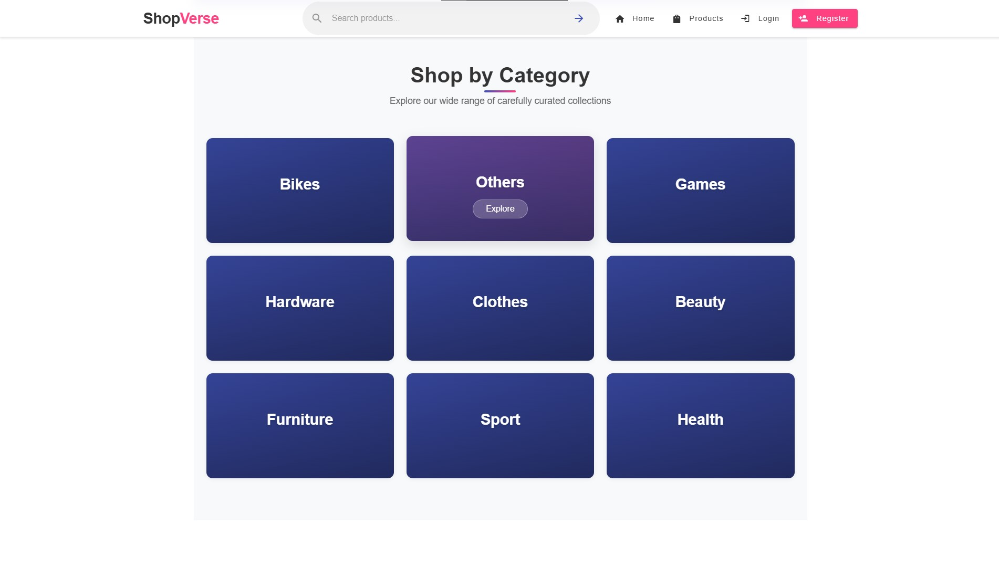
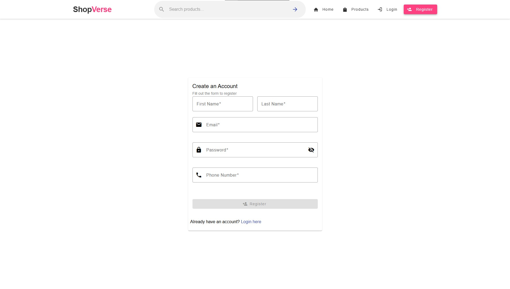
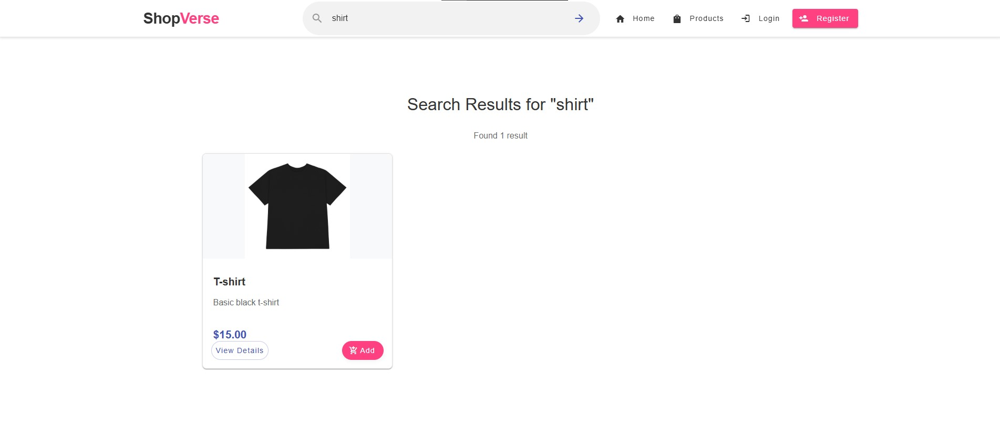
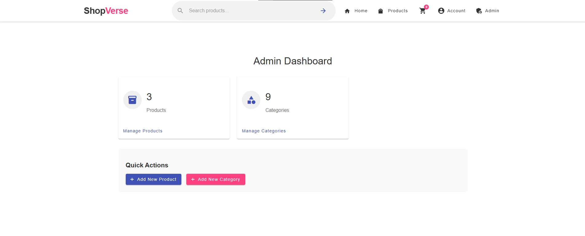
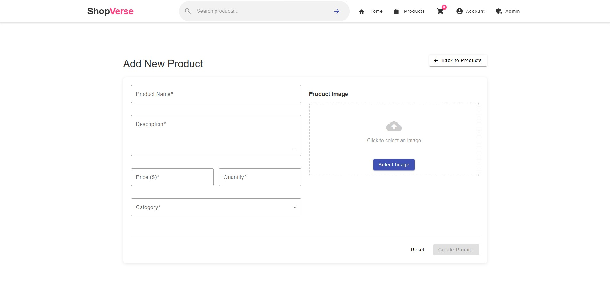

# EcommerceFrontend - ShopVerse

ShopVerse is a modern e-commerce frontend application built with Angular 18. This project provides a complete online shopping experience with user authentication, product browsing, cart management, checkout process, and admin dashboard for product and category management.

## Table of Contents

- [Features](#features)
- [Technologies Used](#technologies-used)
- [Project Structure](#project-structure)
- [Setup and Installation](#setup-and-installation)
- [Preview](#preview)
- [API Integration](#api-integration)
- [Contributing](#contributing)
- [Author](#author)

## Features

- **User Authentication**: Registration, login, and account activation
- **Product Browsing**: View all products or filter by category
- **Search Functionality**: Find products using the search bar
- **Shopping Cart**: Add, update, and remove items
- **Checkout Process**: Shipping information, payment details, and order confirmation
- **Admin Panel**: Complete product and category management
- **Responsive Design**: Works on desktop, tablet, and mobile devices

## Technologies Used

- **Angular 18**
- **Angular Material UI**
- **RxJS**
- **JWT Authentication**
- **REST API Integration**

## Preview

Below are previews of key screens from the application:

### Home Page

The main landing page.


### Shop by Category

Visually browse different product categories.


### Featured Products

Showcase of highlighted products.


### Why Shop With Us Section

Highlighting the main benefits of shopping with ShopVerse.


### Login Page

User authentication screen.


### Registration Page

User registration form.


### Products Page

Browse all products with category filtering.


### Product Detail Page

Detailed view of a specific product.


### Search Results

Results page after searching for products.


### Shopping Cart

View and manage items in the cart.


### Checkout Page

Complete the purchase with shipping and payment details.


### Admin Dashboard

Overview of store management for administrators.


### Product Management

Admin interface for managing products.


### Add Product Form

Form for adding new products to the store.


### Category Management

Admin interface for managing product categories.


## Setup and Installation

1. **Clone the repository**

   ```
   git clone https://github.com/galileo680/ecommerce-frontend.git
   cd ecommerce-frontend
   ```

2. **Install dependencies**

   ```
   npm install
   ```

3. **Configure environment**

   - Update `src/environments/environment.ts` with your API URL

4. **Run the development server**

   ```
   ng serve
   ```

5. **Build for production**
   ```
   ng build --prod
   ```

## Author

Bartłomiej Głuchowicz
