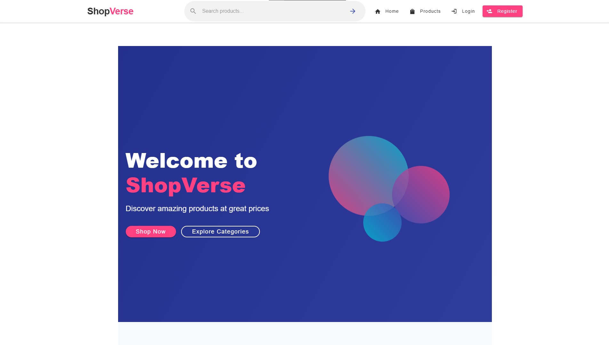

# EcommerceFrontend - ShopVerse

ShopVerse is a modern e-commerce frontend application built with Angular 18. This project provides a complete online shopping experience with user authentication, product browsing, cart management, checkout process, and admin dashboard for product and category management.

## Table of Contents

- [Features](#features)
- [Technologies Used](#technologies-used)
- [Project Structure](#project-structure)
- [Setup and Installation](#setup-and-installation)
- [Preview](#preview)
- [API Integration](#api-integration)
- [Contributing](#contributing)
- [Author](#author)

## Features

- **User Authentication**: Registration, login, and account activation
- **Product Browsing**: View all products or filter by category
- **Search Functionality**: Find products using the search bar
- **Shopping Cart**: Add, update, and remove items
- **Checkout Process**: Shipping information, payment details, and order confirmation
- **Admin Panel**: Complete product and category management
- **Responsive Design**: Works on desktop, tablet, and mobile devices

## Technologies Used

- **Angular 18**: Latest version of the Angular framework
- **Angular Material**: UI component library
- **TypeScript**: For type-safe code
- **RxJS**: For reactive programming
- **Angular Standalone Components**: For modular architecture
- **JWT Authentication**: Secure user authentication
- **REST API Integration**: For backend communication

## Preview

Below are previews of key screens from the application:

### Home Page

The main landing page showing featured products and categories.

### Why Choose Us Section

Highlighting the main benefits of shopping with ShopVerse.

### Login Page

User authentication screen.

### Registration Page

User registration form.

### Products Page

Browse all products with category filtering.

### Product Detail Page

Detailed view of a specific product.

### Search Results

Results page after searching for products.

### Shopping Cart

View and manage items in the cart.

### Checkout Page

Complete the purchase with shipping and payment details.

### Admin Dashboard

Overview of store management for administrators.

### Product Management

Admin interface for managing products.

### Add Product Form

Form for adding new products to the store.

### Category Management

Admin interface for managing product categories.

### Shop by Category

Visually browse different product categories.

### Featured Products

Showcase of highlighted products.

### Special Offers

Promotional section for discounted items.

